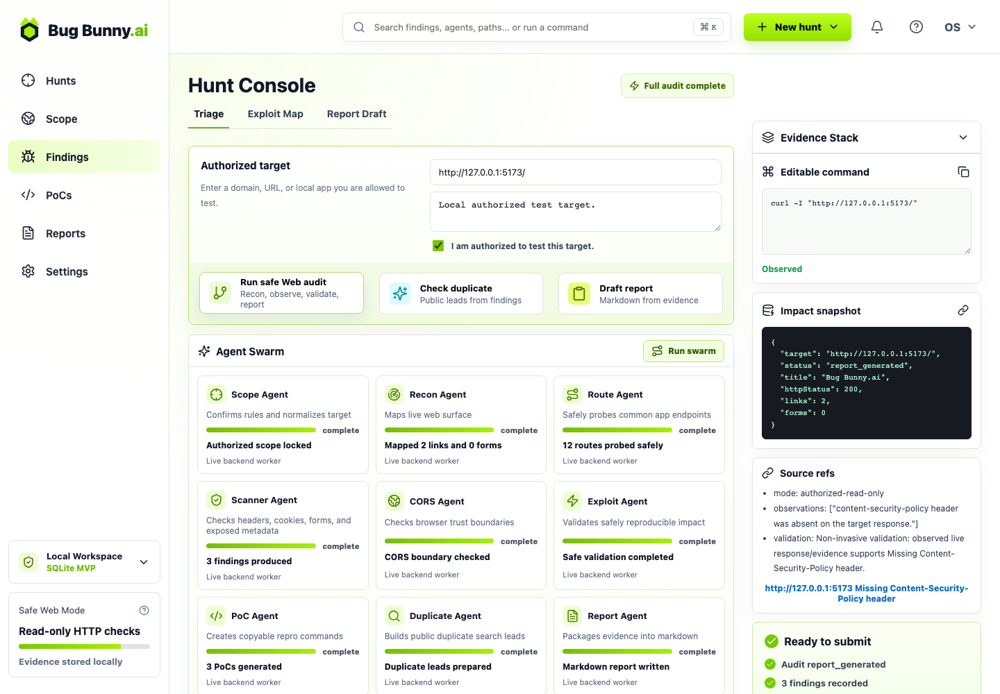
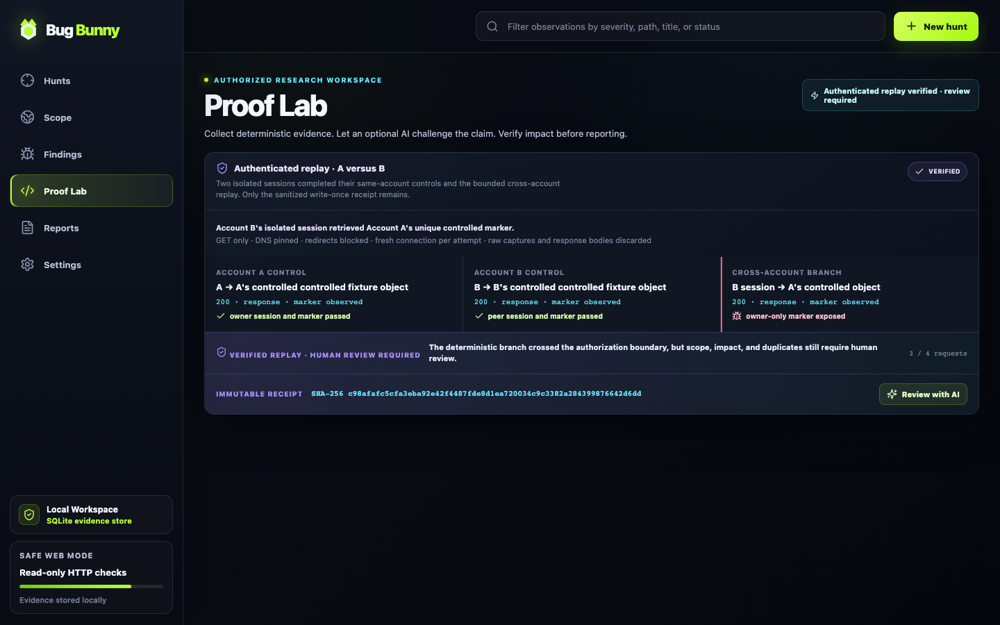

<div align="center">

# 🐰 Bug Bunny

### Capture the request. Replay the claim. Preserve the proof.

`AUTHENTICATED REPLAY` &nbsp; `LOCAL-FIRST` &nbsp; `VICTIM-CENTERED` &nbsp; `OPENAI BUILD WEEK 2026`

<sub>Built with Codex GPT-5.6 Sol · Model-configurable AI review · React / FastAPI / SQLite · MIT</sub>

</div>

---

> [!IMPORTANT]
> **Observe broadly. Claim narrowly. Prove what matters.**
>
> Bug Bunny collects bounded evidence from local labs, owned systems, and
> explicitly authorized in-scope Web targets. An optional configured AI model
> can challenge unsupported claims, while deterministic proof remains in
> control.

```text
┌─[ BUG BUNNY // AUTHORIZED PROOF CONSOLE ]──────────────────────────┐
│  SCOPE LOCKED   ·   SECRETS EPHEMERAL   ·   RECEIPTS VERIFIABLE   │
└────────────────────────────────────────────────────────────────────┘
```



## From observation to proof

Bug Bunny has five real stages. The authenticated replay stage materially
extends the original localhost IDOR template into a reusable engine for a
reviewed HackerOne, Bugcrowd, or Intigriti program—and for safe localhost
fixtures.

| Stage | What runs | What you get |
| --- | --- | --- |
| **Scope Gate** | Records the target, mode, authorization, and traffic boundary | A persistent run receipt |
| **Evidence Collector** | Runs bounded HTTP/DNS/route/header/cookie/CORS checks | Raw evidence and normalized observations |
| **Authenticated Replay** | Validates two self-controlled sessions and equivalent objects, then runs a bounded A/B authorization differential | A deterministic verdict and sanitized receipt |
| **AI Reviewer** | Sends a redacted saved-evidence packet to the configured OpenCode model | Verdict, unsupported claims, dismissal risk, and next proof requirements |
| **Report Builder** | Combines receipts, evidence, AI provenance, and proof status | A local Markdown observation report |

The **Proof Lab** accepts two DevTools **Copy as cURL** captures from isolated
accounts you own. It parses the captures as data—never as shell commands—and
permits only `GET` against the exact allowlisted origin. The same engine can
evaluate any object-level authorization hypothesis that fits the bounded A/B
control matrix; it is not hard-coded to one route or one vendor.

The AI reviewer cannot mark a finding verified. The replay receipt controls the
tested branch verdict; AI can challenge its evidence and name missing proof.
Every live result remains human-review gated before submission.

## Local / owned-target hunter

| Phase | Bounded behavior | Output |
| --- | --- | --- |
| **Scope** | Requires explicit authorization and records operator limits | Immutable run context |
| **Recon** | DNS, homepage, title, forms, same-origin links, robots.txt | Raw local evidence |
| **Route map** | Same-origin `GET`/`HEAD` checks with time, redirect, and size limits | Route/status inventory |
| **Trust checks** | Headers, cookies, CORS, dotfile validation | Evidence-backed observations |
| **Handoff** | Repro commands, duplicate-search queries, timeline, AI review, Markdown | Persistent SQLite run + report |

Generic hardening gaps are labeled as observations—not inflated into bounty-grade
vulnerabilities. Unbounded exploitation remains disabled for live targets; the
authenticated replay engine is a separate, explicit, minimum-proof workflow.

## Live bounty targets: policy profiles

Choose **Live bounty target** for public HackerOne, Bugcrowd, or Intigriti
programs. Bug Bunny does not apply one generic scanner configuration to every
program: the current policy profile determines the exact host, attribution,
methods, rate, request budget, discovery boundary, and prohibited actions.

### Built-in: Intigriti PWN environment

The first bounded live profile targets Intigriti's own paid research environment
under `*.pwn.intigriti.rocks`:

| Guardrail | Enforced behavior |
| --- | --- |
| **Identity** | Requires the operator's real Intigriti username and sends `X-Intigriti-Username` plus an attributed user agent |
| **Target** | One exact HTTPS host under `*.pwn.intigriti.rocks`; no subdomain enumeration |
| **Traffic** | Hard budget of 24 `GET`/`HEAD` requests at no more than 2 requests/second—below the published 10 requests/second ceiling |
| **Discovery** | Root page, standard policy files, and same-origin public links/assets already referenced by retrieved pages |
| **Client map** | Downloads a bounded set of public JavaScript assets and extracts API/auth route strings without probing those candidates |
| **Blocked** | Cross-origin discovery, form submission, credentials, state changes, payload mutation, DoS, and access to other users' data |
| **Output** | Attributed request ledger, public-asset map, endpoint leads, optional AI review, and a non-submission observation report |

The profile is pinned to the official Intigriti program page and a July 21, 2026
policy snapshot. The operator must still read the current policy and confirm all
authorization gates immediately before every run.

### Reusable authenticated A↔B replay

For a reviewed HackerOne, Bugcrowd, or Intigriti authorization hypothesis,
choose **Authenticated replay**, record the current program and policy, and
allowlist the one exact target host. Use two isolated accounts and two
equivalent objects that you control. From each browser session, copy the
account's own object request with DevTools **Copy as cURL**, then paste both
captures and one benign, unique response marker per object into Proof Lab.

Bug Bunny validates the complete plan before traffic. Both captures must:

- use `GET` on the same exact origin;
- describe the same endpoint shape and differ by exactly one object locator;
- contain the same supported primary-auth header names but distinct primary
  credentials (a rotated CSRF token is not a second account);
- contain no ambiguous account-binding or request-signature headers; and
- remain inside the explicit host allowlist recorded with the run.

The replay matrix is **B→B**, **A→A**, then **B→A**. The engine executes
the two owner controls before trusting the cross-account result, repeats only a
denial once, uses at most four requests, and stops immediately if A's marker is
exposed to B. Markers must be high-entropy and non-overlapping; each control
also proves that the other actor's marker is absent. A process-wide exact-origin
lock and scheduler prevent parallel runs from bypassing the recorded pace.
Redirects are recorded as blocked outcomes and never followed.

| Verdict | Exact meaning |
| --- | --- |
| **`VERIFIED · CROSS_ACCOUNT_OBJECT_EXPOSURE`** | B's isolated session received A's unique controlled marker |
| **`INVALID · NO_CROSS_ACCOUNT_EXPOSURE`** | Both controls passed and the B→A denial was stable on its single repeat |
| **`INCONCLUSIVE`** | A control failed or replay behavior was unstable; no exposure claim is made |

Raw cURLs, session values, URLs, object locators, response markers, headers, and
request/response bodies are held only for the immediate replay and are never
written to SQLite, logs, or run artifacts. The run keeps only a write-once,
sanitized receipt with file mode `0600`, containing derived metadata, outcome
booleans, hashes, request count, and an integrity SHA-256.

The earlier real controlled PWN run tested whether Account B could open Account
A's known submission draft. A's owner control succeeded; B received Forbidden
twice. Bug Bunny correctly closed only that tested branch as **`INVALID · NO
IDOR`**, created zero findings, and kept the submission gate closed.


### Custom program: one-response fallback

For a program without a reviewed built-in profile, Bug Bunny keeps the smaller
one-response mode.

Before it will run, Bug Bunny records the platform, program name, current policy
URL, exact HTTPS in-scope URL, and two explicit operator acknowledgements. It
then enforces this fixed boundary:

| Guardrail | External Program behavior |
| --- | --- |
| **Target** | One exact public HTTPS URL; IP literals and localhost are rejected |
| **Traffic** | One `GET` request, paced at no more than one HTTP request per second |
| **Redirects** | Recorded but never followed |
| **Discovery** | No link following, robots/sitemap fetches, route guessing, or dotfile checks |
| **Browser probes** | No CORS origin manipulation, auth, payload mutation, or exploitation |
| **Output** | Local observation ledger only; no PoC, duplicate verdict, severity claim, or submission-ready report |

The resulting evidence is a prioritization hint, not a finding. An optional AI
reviewer can challenge the saved evidence and propose the safest manual next
step, but it cannot increase the traffic budget or turn an observation into a
submission.
Manually verify current scope, meaningful impact, duplicates, and a
victim-centered proof before writing any vulnerability report. Program policies
change: open and read the current policy yourself before acknowledging the gate.

## Replay protocol, at a glance

```text
DevTools capture A ─┐
                    ├─► validate + redact ─► B→B ─► A→A ─► B→A
DevTools capture B ─┘                                  │
                                                      ├─ marker exposed ─► stop / VERIFIED
                                                      └─ denied ─► repeat once / INVALID
                                                                      or INCONCLUSIVE
```

| | Check | Truth established |
| :---: | --- | --- |
| `01` | **B→B peer control** | B's isolated session can retrieve B's equivalent marker |
| `02` | **A→A owner control** | A's session can retrieve A's marker |
| `03` | **B→A disputed replay** | B either receives A's marker or a denial |
| `04` | **Minimum repeat** | One denial is repeated once; exposure is never repeated |
| `05` | **Receipt** | Secrets stay ephemeral; sanitized outcomes and integrity hashes persist |

> [!NOTE]
> This is not a status-code demo. `VERIFIED` requires A's unique controlled
> response marker to appear under B's isolated session. A `200` without the
> marker cannot prove exposure.



[Watch the 79-second authenticated replay browser demo](evidence/dev-week/authenticated-replay-demo.webm)
or inspect the exact
[sanitized receipt](evidence/dev-week/authenticated-replay-receipt.json) and
[recorded AI challenge receipt](evidence/dev-week/authenticated-replay-kimi-receipt.json).

The original deterministic IDOR template remains available as a smaller local
regression proof in `proofs/idor_proof.py`. It seeds attacker and victim data on
an ephemeral `127.0.0.1` port, asserts the negative and truthful controls, then
writes a redacted proof artifact. The reusable engine adds real DevTools
captures, structural endpoint validation, explicit host policy, network
pinning, bounded replay, and write-once receipts.

## Run it

```bash
git clone https://github.com/sftwrstef/bug-bunny.git
cd bug-bunny

npm ci
python3 -m venv .venv
.venv/bin/pip install -r requirements.txt

# Optional AI-review stage:
# install OpenCode, authenticate a provider, and set BUG_BUNNY_AI_MODEL
# to a model that appears in `opencode models`.

npm run dev
```

Open `http://127.0.0.1:5173`. `npm run dev` starts the React console on port
5173, the persistent FastAPI service on port 8000, and the bounded Web engine.

### Tested platform

The full judge path is confirmed on macOS 26.5 (Apple silicon), Node.js 25.9.0,
npm 11.12.1, Python 3.14.4, and Chromium. The application runtime requires
Node.js `^20.19.0 || >=22.12.0` and Python 3.10 or newer. The optional narrated
MP4 renderer uses macOS system speech; the Web app, API, fixtures, and tests do
not depend on it.

### Five-minute authenticated replay

Use the deliberately vulnerable localhost fixture first. It never contacts a
third-party target and prints disposable capture values and markers for the
demo.

```bash
# Terminal 1
npm run dev

# Terminal 2
npm run fixture:replay:vulnerable
```

In Bug Bunny:

1. Choose **Local / owned target → Authenticated replay**.
2. Set the target to `http://127.0.0.1:8899/`, record that it is the bundled
   fixture, confirm authorization, and select **Prepare authenticated replay**.
3. Open **Proof Lab**. Paste the fixture's Account A cURL for object A and
   Account B cURL for object B into their respective secret paste zones.
4. Select **Preview redaction**. Confirm the sanitized request shape, distinct
   session fingerprints, and `0 / 4` request budget.
5. Paste `MARKER_A` and `MARKER_B` from the fixture terminal, confirm all three
   ownership/isolation gates, and select **Run bounded replay**.

The vulnerable fixture stops after three requests with **`VERIFIED ·
CROSS_ACCOUNT_OBJECT_EXPOSURE`**. To exercise the denial branch, stop the
fixture and run:

```bash
npm run fixture:replay:secure
```

Create a fresh run and repeat the same flow. The secure fixture uses all four
requests—the single denied B→A attempt plus one stability repeat—and closes the
tested hypothesis as **`INVALID · NO_CROSS_ACCOUNT_EXPOSURE`**.

To reproduce the judge recording and its narrated macOS upload file:

```bash
npm run demo:replay:record
.venv/bin/pip install -r requirements-demo.txt
npm run demo:replay:render
```

The recorder starts the vulnerable fixture when necessary, refuses console or
API errors, verifies that saved data contains no fixture secrets, and captures
the screenshot plus 79-second WebM. The renderer uses macOS speech synthesis
and a pinned `imageio-ffmpeg` binary to create the local H.264/AAC MP4.

### Real reviewed program

For live work, first read the current program policy yourself. Then:

1. Choose **Live bounty target → Authenticated replay — any reviewed program**.
2. Record HackerOne, Bugcrowd, or Intigriti; the program name; current policy
   URL; exact HTTPS target; explicit hostnames with no wildcards; and one
   victim-centered hypothesis.
3. Confirm that the policy permits the four-request `GET`-only validation, both
   accounts and objects are yours, and you will stop on unexpected exposure.
4. Capture each account reading its own equivalent object with DevTools **Copy
   as cURL**. Preview before execution; the raw capture fields are cleared after
   every attempt.
5. Review the deterministic receipt, optionally ask the configured AI model to
   challenge the saved evidence, and generate the report. Manually validate
   scope, impact, and duplicates before considering any submission.

For ordinary recon, choose **Local / owned target → Bounded recon** or a reviewed
live mapping profile, then follow **Collect bounded evidence → Review current
run with AI → Generate evidence report**.

Use **Proof Lab → Run real proof** for the deterministic localhost IDOR replay.
Use **Settings → Refresh status** to confirm the configured model and
OpenCode provider credential are available before optional analysis.

For the reviewed live profile, select **Live bounty target → Intigriti PWN
environment**, enter your real Intigriti username, read the current policy, and
confirm every authorization gate. Bug Bunny will not enable the run button until
the identity and policy acknowledgements are complete.

The earlier strict manual controlled-proof import remains available for its
existing PWN receipt, but new A/B work should use capture-and-replay so the
controls, network boundary, response hashes, request count, and verdict are
produced by the engine rather than entered by hand.

For any other program, select **Custom program — one passive response**, record
the exact in-scope URL and current policy, and confirm the smaller read-only
boundary. Every generated ledger is evidence—not a bounty submission.

### Verify the build

Run these exact commands from the repository root:

```bash
npm run test:proof
npm run test:web
npm run build
npm audit --omit=dev
```

`test:proof` currently runs 32 tests covering replay parsing and rejection,
primary-session isolation, ambiguous-header rejection, high-entropy marker and
negative-marker controls, exact-origin locking and pacing, the three/four-request
stop conditions, redirect blocking, verdict derivation, secret absence,
artifact integrity, file-mode `0600` persistence, AI redaction, and the original
deterministic IDOR proof. `test:web` runs six bounded Web-engine tests against
deterministic fixtures.

One historical optional-AI smoke test is preserved in
[`evidence/dev-week/kimi-runtime-receipt.json`](evidence/dev-week/kimi-runtime-receipt.json),
and deterministic proof evidence is in
[`evidence/dev-week/verified-idor-proof.json`](evidence/dev-week/verified-idor-proof.json).
The controlled live-result capture is
[`evidence/dev-week/controlled-proof-closed.png`](evidence/dev-week/controlled-proof-closed.png).
The reusable authenticated-replay screenshot, public-safe receipt, optional-AI
test receipt, recording, narration, and subtitles are indexed in
[`evidence/dev-week/README.md`](evidence/dev-week/README.md). The upload-ready
79.23-second H.264/AAC export is generated locally at
`output/demo/bug-bunny-final-demo.mp4`.

## Inside the repo

```text
src/                    React hunt console + real pipeline views
server/auditEngine.js   Bounded live Web recon and analysis engine
backend/                Persistent API, model-configurable AI bridge, report + proof gates
backend/replay_engine.py Structural cURL parser + pinned bounded replay engine
.opencode/agents/       Tool-denied Bug Bunny evidence-review agent
proofs/idor_proof.py    Original deterministic localhost IDOR template
proofs/authenticated_replay_demo.py  Vulnerable/secure localhost A/B fixture
tests/                  Web, replay, AI-boundary, and deterministic proof tests
evidence/dev-week/      Runtime receipts, proof artifact, and demo captures
```

## Dev Week provenance

| Pre-existing baseline | Dev Week extension |
| --- | --- |
| Dashboard, FastAPI API, SQLite storage, disconnected Web engine | Live engine integration, scope guardrails, optional AI evidence review, persistent evidence, verified IDOR replay, reusable authenticated capture-and-replay, focused tests |

**Codex with GPT-5.6 Sol built the product. Optional runtime AI review is
model-configurable through OpenCode.** The configured model receives only saved,
redacted evidence; it does not drive the replay, hold credentials, browse the
target, or decide a deterministic verdict. Model, provider, session, token,
cost, latency, and redacted-input hash are stored with each analysis. The
included historical receipt used Kimi K3 only as a runtime smoke-test provider.
Primary Codex build task: `019f7376-015c-78b3-a2ea-7b43e4b03b40`. The required
`/feedback` receipt remains a separate final submission field; it is not
fabricated from this task identifier.

Read the boundary in [`PREEXISTING.md`](PREEXISTING.md) and [`DEV_WEEK_WORK.md`](DEV_WEEK_WORK.md).
The copy-ready Devpost fields and final external checklist are in
[`DEVPOST_SUBMISSION.md`](DEVPOST_SUBMISSION.md).

## License

Bug Bunny is released under the [MIT License](LICENSE).

---

<div align="center">

`make the harm legible.`

</div>
