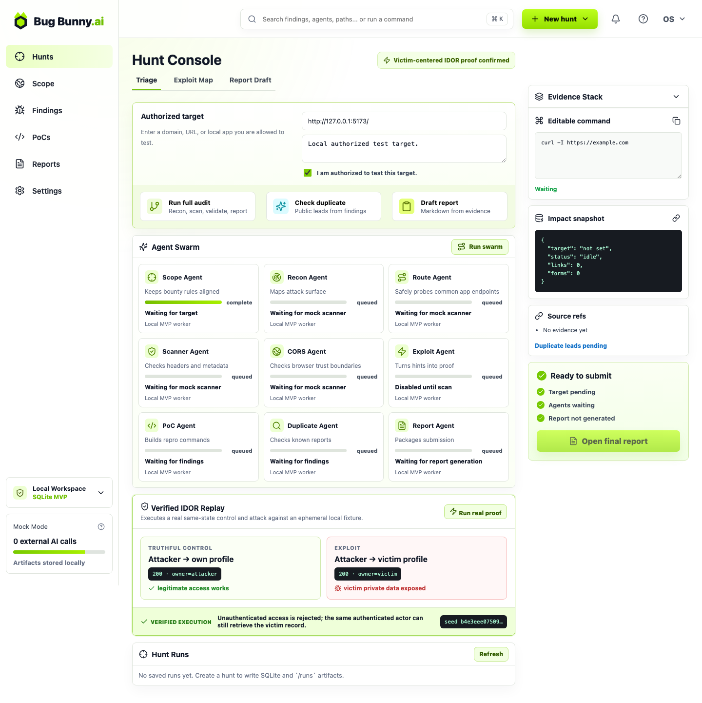

# 🐰 Bug Bunny

> Turn a security finding into a reproducible, victim-centered proof — before it becomes a report.

**Bug Bunny** is a local security-proof console: a React dashboard, FastAPI backend,
SQLite storage, per-run evidence, and a verified IDOR replay you can run in seconds.

The original May audit pipeline remains in mock-scanner mode. The OpenAI Build Week
extension adds a real, bounded proof against an ephemeral localhost fixture — no
external target contact and no API key required.



## What it proves

| Check | Expected result |
| --- | --- |
| Unauthenticated request | Rejected with `401` |
| Truthful control | Attacker can read only their own profile |
| Disputed request | Attacker reads the victim profile and private data |
| Evidence | Redacted, hashed JSON artifact saved locally |

This is intentionally more than a scanner-shaped UI: the replay starts a live local
HTTP service, runs the control and exploit from the same seeded state, asserts the
victim-centered harm, and preserves an inspectable result.

## Run it locally

```bash
git clone https://github.com/sftwrstef/bug-bunny.git
cd bug-bunny

npm install
python3 -m venv .venv
.venv/bin/pip install -r requirements.txt

npm run dev
```

Open the local URL printed by Vite, then select **Run verified IDOR replay** in the
dashboard. The backend runs at `http://127.0.0.1:8000`.

### Run the proof from the terminal

```bash
.venv/bin/python -m unittest tests.test_idor_proof -v
```

The resulting artifact is written to
[`evidence/dev-week/verified-idor-proof.json`](evidence/dev-week/verified-idor-proof.json).

## How the verified replay works

1. Start a deliberately vulnerable profile API on `127.0.0.1` using a random port
   and deterministic attacker/victim seed data.
2. Prove the negative control: an unauthenticated request is rejected.
3. Prove the truthful control: the authenticated attacker successfully reads their
   own profile.
4. From the same identity and state, request the victim profile.
5. Assert exposure of the victim's private data, redact the bearer token, hash the
   relevant state and responses, and save the evidence.

The fixture is purpose-built for local demonstration. It never probes or contacts a
third-party system.

## Project map

```text
src/                    React dashboard and proof matrix
backend/                FastAPI application and SQLite persistence
proofs/idor_proof.py    Ephemeral vulnerable fixture and replay engine
tests/                  Focused end-to-end proof test
evidence/dev-week/      Generated proof artifact and demo screenshot
```

## API

| Endpoint | Purpose |
| --- | --- |
| `GET /api/health` | Health check |
| `POST /api/proofs/idor/run` | Execute the verified local IDOR replay |
| `POST /api/audits/create` | Create an audit run |
| `POST /api/audits/{run_id}/run-mock-scan` | Run the original mock scan flow |
| `GET /api/audits/{run_id}/findings` | Read findings for an audit run |
| `POST /api/audits/{run_id}/generate-report` | Generate an audit report |

## OpenAI Build Week provenance

| Work | Status |
| --- | --- |
| React dashboard, FastAPI API, SQLite storage, mock audit pipeline | Pre-existing baseline |
| Verified IDOR replay, control/exploit matrix, evidence artifact, focused test, UI integration | Built during Dev Week |

The Build Week extension was developed collaboratively with **Codex** using
**GPT-5.6 Sol**. Primary Codex session: `019f7376-015c-78b3-a2ea-7b43e4b03b40`.

See [`PREEXISTING.md`](PREEXISTING.md) for the preserved baseline and
[`DEV_WEEK_WORK.md`](DEV_WEEK_WORK.md) for the eligible extension and verification
notes.

## Tech

- React + Vite
- Python + FastAPI
- SQLite
- Vanilla CSS

## Submission notes

- Run `/feedback` in the Codex session before submitting, and retain that session
  identifier with the project evidence.
- Keep the Dev Week commits, the generated JSON artifact, this screenshot, and the
  setup instructions above available for judging.
- This repository demonstrates a local proof workflow only; it is not a tool for
  scanning external services.
